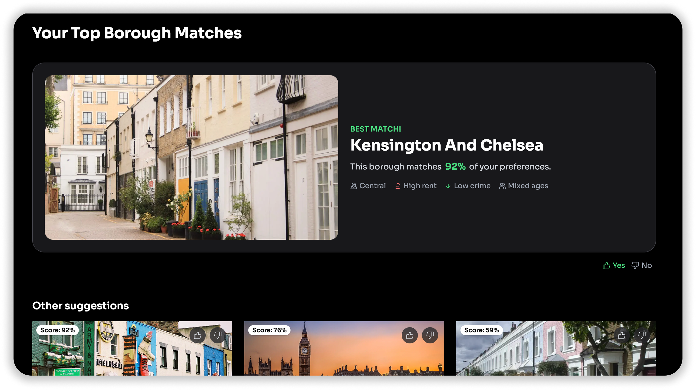

<h1 align="center">
  FindMyBorough
</h1>

<p align="center">
    <strong>FindMyBorough</strong> is a machine learning–based system for recommending London boroughs based on user-defined preferences.
    
</p>

## Overview

This project explores how a personalized recommendation system can assist individuals in choosing where to live in a large metropolitan area like London. The system combines synthetic user preference data with real-world borough-level statistics to return a ranked list of boroughs tailored to the user’s profile.

Users are asked to weight four criteria:

- Affordability (proxied by normalized rent prices)
- Crime rate (based on reported incidents)
- Age distribution
- Proximity to Central London

## Tech Stack

- Backend: Django + Django REST Framework
- ML model: PyTorch + skopt (Bayesian Optimization)
- Data tools: pandas, numpy
- Frontend: Next.js + Tailwind CSS

## Project Structure

```bash
.
├── backend # Django backend
│ ├── ml_model # Data processing, training scripts, ML logic
│ ├── recommender # Recommendation related API
│ ├── borough  # Borough related API
│ ├── accounts # User authentication
│ ├── scripts # Utility scripts
│ └── seeds # Initial data
│
├── frontend # Next.js frontend
│ └── src # App pages, components, services, styling
```

## Environments

- Production: coming soon!

- Staging: https://staging.findmyborough.uk/

## Additional Documentation

- **Data sheet** – Details on data sources, structure, preprocessing, and limitations. [View](./data_sheet.md)

- **Model card** – Description of the model architecture, input/output, performance metrics, and trade-offs. [View](./model_card.md)
